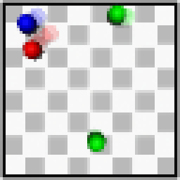

# Object-centric hierarchical bottleneck
This repository contains the reference implementation of the hierarchical bottleneck approach proposed in the thesis Disentangling Object-Centric Video Representations under Sparse Perturbations. The model separates object-centric video representation learning into three stages: a Slot Attention stage for per-frame object decomposition, an explicit bottleneck for single-frame object properties, and an implicit dynamics stage for temporally inferred information and prediction. It is designed for controlled experiments on synthetic video data with sparse object-level perturbations.

## Setup

This project was tested with Python 3.10.

### Reproducible installation with uv

Clone the repository and create the project environment with:

```bash
git clone https://github.com/nalpure/object-centric-hierarchical-bottleneck.git
cd object-centric-hierarchical-bottleneck
uv sync
export PYTHONPATH=src
```

To verify that the environment is set up correctly, run:

```bash
uv run python scripts/smoke_test.py
uv run python -m train --help
uv run python -m encode_data --help
uv run python -m eval_module --help
uv run python -m eval_pipeline --help
uv run python -m eval_rollout --help
```

The dependency versions used for reproducible installation are locked in `uv.lock`.

### Notes

- The project currently targets Python 3.10.
- PyTorch is pinned to version `2.4.1`.
- GPU support depends on having a compatible NVIDIA driver and CUDA setup.
- All commands in this repository should be run via `uv run ...` after `uv sync`.

After setting up the environment as described above, the experiments can be run as follows.

## Training
To train a standard SlotAttention model for reconstruction on a Slipscape dataset run

```bash
python -m train SA --name RUN_NAME --data PATH_TO_DATASET --base RUN_NAME
```

To load the checkpoint with lowest total loss (a different checkpoint can be specified using the flag '--base-epoch NUMBER') and continue training with an additional contrastive and background attention loss, run
```bash
python -m train SA_disent --name RUN_NAME_DIS --data PATH_TO_DATSET --base RUN_NAME
```

To convert the original Slipscape dataset into a dataset containing per-frame slot representations using the trained SlotAttention model run
```bash
python -m encode_data --data PATH_TO_SLIPSCAPE_DATASET --ckpt PATH_TO_CHECKPOINT
```
The file will be saved in the same directory of the checkpoint.

To train the explicit Autoencoder for reconstruction of slots from explicit latents run
```bash
python -m train explicit_latents --name RUN_NAME_DIS --data PATH_TO_SLOT_DATSET
```
For training with disentanglement you may use the configuration file 'explicit_latents_disent' instead.

To convert the dataset containing per-frame slot representations to per-frame explicit latents run
```bash
python -m encode_data --data PATH_TO_SLOT_DATASET --ckpt PATH_TO_CHECKPOINT
```

To train an image predictor using per-sequence implicit latent representations run
```bash
python -m train implicit_dynamics --name RUN_NAME_DIS --data PATH_TO_EXPLICIT_DATSET
```

## Evaluation

To evaluate a single module run
```bash
python -m eval_module --data PATH_TO_DATASET --ckpt PATH_TO_CHECKPOINT
``` 
This will create an evaluation directory, containing the evaluation losses. In the case of a slot attention autoencoder checkpoint, the directory will include sample plots.

Once all three modules of the pipeline are trained, the whole pipeline may be evaluated by running
```bash
python -m eval_pipeline --data PATH_TO_SLIPSCAPE_DATASET --ckpt PATH_TO_DYNAMICS_CHECKPOINT
```

Similarly, once all modules are trained you may create artificial rollouts where future frames are predicted recursively and the final sequence gets saved as a .gif file, by running 
```bash
python -m eval_rollout --data PATH_TO_SLIPSCAPE_DATASET --ckpt PATH_TO_DYNAMICS_CHECKPOINT
```
